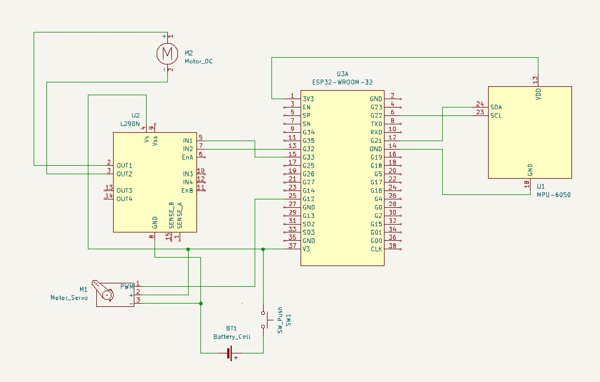
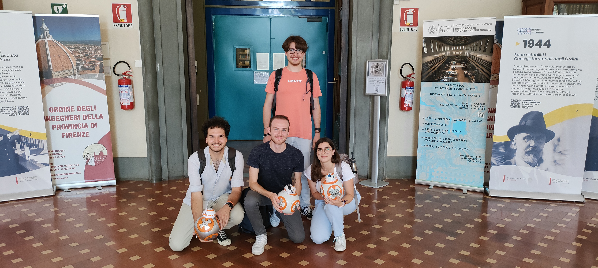

# RoundRover
Star Wars BB8-style 3D Printed Robot

Designed and developed by [Lorenzo Cicali](https://www.github.com/Lorentz99), [Ginevra Dazzi](https://www.github.com/Gine99), [Tommaso Matteuzzi](https://www.github.com/tommasomatt) and [Martino Falorni](https://www.github.com/EmmeEffe),

---

## Goal
The project has been realized for the Automation Control Laboratory exam at University of Florence.

You can find the video of the project below: 

## Printing
You can use a 3D FDM Printer to print all the pieces for the project. 
We have printed them in PLA.

You can find the files in the [StlFiles](StlFiles/) folder.

You have to fill the balancer with lead balls ad glue the cover onto it:
- [Balancer Leg](StlFiles/balancer_leg.stl)
- [Balancer Cover](StlFiles/balancer_cover.stl)

Then print the transmission gears. Thoose are made for a 2.5mm belt
- [Big Gear](StlFiles/bigGear.stl)
- [Small Gear](StlFiles/smallGear.stl)

Then print the main body with the external ring
- [Main Body](StlFiles/body.stl)
- [External Ring](StlFiles/ring.stl)
- [Bearing Holder](StlFiles/bearingHolder.stl) (print 2 times)

## Parts
- Mechanic Hardware
  - 2 x plastic semisphere, diameter 200 mm
  - 1x Metal shaft, 160 mm, 8 mm ø
  - 2x Metal ball bearing, 8x22x7mm
  - 1x Transmission belt 2.5T
  - fishing Lead weights
  - Neodimium Magnets
  - bolts and nuts
  - threaded inserts for 3d prints
- Electronic Hardware
  - 9V battery
  - H-bridge board MX1616H
  - ESP32 board
  - IMU system MPU-6050
  - Servomotor 9g
  - Gear motor, DC, supply voltage 3-12 Volt, 200 rpm

## Circuit
We have realized the circuit on a perfboard following the schematic below:

## Software 
The software is coded in Simulink. You can find all the code in the [SimulinkFiles](SimulinkFiles) folder.

[controlSystem.slx](SimulinkFiles/controlSystem.slx) has to be loaded onto the ESP32 board, [RemoteController.slx](SimulinkFiles/RemoteController.slx) will go on an Android device and is used to control the robot.

# Authors
Designed and developed by [Lorenzo Cicali](https://www.github.com/Lorentz99), [Ginevra Dazzi](https://www.github.com/Gine99), [Tommaso Matteuzzi](https://www.github.com/tommasomatt) and [Martino Falorni](https://www.github.com/EmmeEffe)

