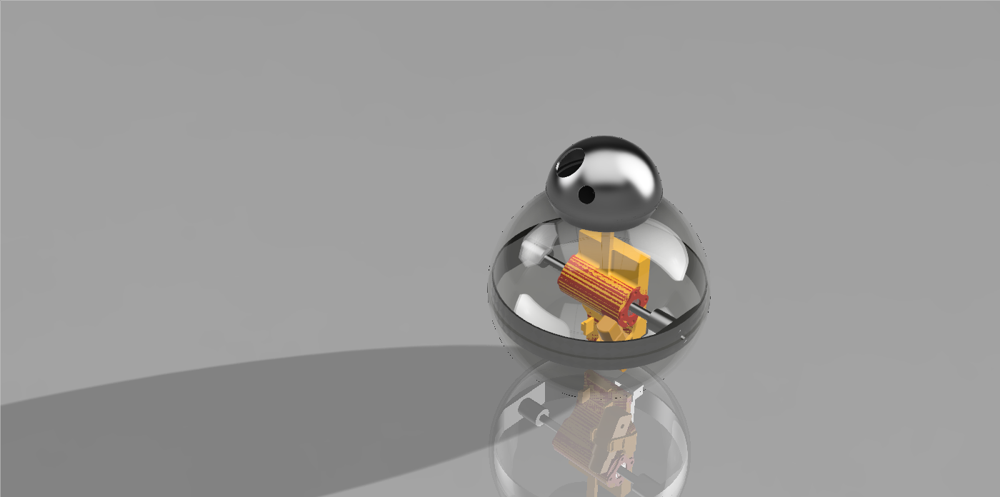

# RoundRover
Star Wars BB8-style 3D Printed Robot

Designed and developed by [Lorenzo Cicali](https://www.github.com/Lorentz99), [Ginevra Dazzi](https://www.github.com/Gine99), [Tommaso Matteuzzi @tommasomatt](https://www.github.com/tommasomatt) and [Martino Falorni @EmmeEffe](https://www.github.com/EmmeEffe),

---

## Printing
You can use a 3D FDM Printer to print all the pieces for the project. 
We have printed them in PLA.

You can find the files in the [StlFiles](StlFiles/) folder.

You have to fill the balancer with lead balls ad glue the cover onto it:
- [Balancer Leg](StlFiles/balancer_leg.stl)
- [Balancer Cover](StlFiles/balancer_cover.stl)

Then print the transmission gears. Thoose are made for a 2.5mm belt
- [Big Gear](StlFiles/bigGear.stl)
- [Small Gear](StlFiles/smallGear.stl)

Then print the main body with the external ring
- [Main Body](StlFiles/body.stl)
- [External Ring](StlFiles/ring.stl)
- [Bearing Holder](StlFiles/bearingHolder.stl) (print 2 times)

